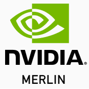

# TensorFlow Recommenders Addons
-----------------

[](https://pypi.org/project/tensorflow-recommenders-addons/)
[](https://pypi.org/project/tensorflow-recommenders-addons/)
[](docs/api_docs/)

TensorFlow Recommenders Addons(TFRA) are a collection of projects related to large-scale recommendation systems 
built upon TensorFlow by introducing the **Dynamic Embedding Technology** to TensorFlow 
that makes TensorFlow more suitable for training models of **Search, Recommendations, and Advertising** and 
makes building, evaluating, and serving sophisticated recommenders models easy. 
See approved TensorFlow RFC #[313](https://github.com/tensorflow/community/pull/313).
Those contributions will be complementary to TensorFlow Core and TensorFlow Recommenders etc. 

For Apple silicon(M1), please refer to [Apple Silicon Support](#apple-silicon-support).

## Main Features

- Make key-value data structure (dynamic embedding) trainable in TensorFlow
- Get better recommendation effect compared to static embedding mechanism with no hash conflicts
- Compatible with all native TensorFlow optimizers and initializers
- Compatible with native TensorFlow CheckPoint and SavedModel format
- Fully support train and inference recommenders models on GPUs
- Support [TF serving](https://github.com/tensorflow/serving) and [Triton Inference Server](https://github.com/triton-inference-server/server) as inference framework
- Support variant Key-Value implements as dynamic embedding storage and easy to extend
  - [cuckoohash_map](https://github.com/efficient/libcuckoo) (from Efficient Computing at Carnegie Mellon, on CPU)
  - [HierarchicalKV](https://github.com/NVIDIA-Merlin/HierarchicalKV) (from NVIDIA, on GPU)
  - [Redis](https://github.com/redis/redis)
- Support half synchronous training based on Horovod
  - Synchronous training for dense weights
  - Asynchronous training for sparse weights

## Subpackages

* [tfra.dynamic_embedding](docs/api_docs/tfra/dynamic_embedding.md), [RFC](rfcs/20200424-sparse-domain-isolation.md)
* [tfra.embedding_variable](https://github.com/tensorflow/recommenders-addons/blob/master/docs/tutorials/embedding_variable_tutorial.ipynb), [RFC](https://docs.google.com/document/d/1odez6-69YH-eFcp8rKndDHTNGxZgdFFRJufsW94_gl4)

## Contributors

TensorFlow Recommenders-Addons depends on public contributions, bug fixes, and documentation.
This project exists thanks to all the people and organizations who contribute. [[Contribute](CONTRIBUTING.md)]

<a href="https://github.com/tensorflow/recommenders-addons/graphs/contributors">
  
</a>


\
<a href="https://github.com/tencent">
  <kbd>  </kbd>
</a><a href="https://github.com/alibaba">
  <kbd>  </kbd>
</a><a href="https://vip.com/"> 
  <kbd>  </kbd>
</a><a href="https://www.zhipin.com//">
  <kbd>  </kbd>
</a>

\
A special thanks to [NVIDIA Merlin Team](https://github.com/NVIDIA-Merlin) and NVIDIA China DevTech Team, 
who have provided GPU acceleration technology support and code contribution.

<a href="https://github.com/NVIDIA-Merlin">
  <kbd>  </kbd>
</a>


## Tutorials & Demos
See [tutorials](docs/tutorials/) and [demo](demo/) for end-to-end examples of each subpackages.

## Installation
#### Stable Builds
TensorFlow Recommenders-Addons is available on PyPI for Linux, macOS. To install the latest version, 
run the following:
```
pip install tensorflow-recommenders-addons
```

By default, CPU version will be installed. To install GPU version, run the following:
```
pip install tensorflow-recommenders-addons-gpu
```

To use TensorFlow Recommenders-Addons:

```python
import tensorflow as tf
import tensorflow_recommenders_addons as tfra
```

### Compatibility with Tensorflow
TensorFlow C++ APIs are not stable and thus we can only guarantee compatibility with the 
version TensorFlow Recommenders-Addons(TFRA) was built against. It is possible TFRA will work with 
multiple versions of TensorFlow, but there is also a chance for segmentation faults or other problematic 
crashes. Warnings will be emitted if your TensorFlow version does not match what it was built against.

Additionally, TFRA custom ops registration does not have a stable ABI interface so it is 
required that users have a compatible installation of TensorFlow even if the versions 
match what we had built against. A simplification of this is that **TensorFlow Recommenders-Addons 
custom ops will work with `pip`-installed TensorFlow** but will have issues when TensorFlow 
is compiled differently. A typical example of this would be `conda`-installed TensorFlow.
[RFC #133](https://github.com/tensorflow/community/pull/133) aims to fix this.


#### Compatibility Matrix
*GPU is supported by version `0.2.0` and later.*

| TFRA  | TensorFlow | Compiler   | CUDA | CUDNN | Compute Capability           | CPU      |
|:------|:-----------|:-----------|:-----|:------|:-----------------------------|:---------|
| 0.7.0 | 2.15.1     | GCC 8.2.1  | 12.2 | 8.9   | 7.0, 7.5, 8.0, 8.6, 8.9, 9.0 | x86      |
| 0.7.0 | 2.15.1     | Xcode 13.1 | -    | -     | -                            | Apple M1 |
| 0.6.0 | 2.8.3      | GCC 7.3.1  | 11.2 | 8.1   | 6.0, 6.1, 7.0, 7.5, 8.0, 8.6 | x86      |
| 0.6.0 | 2.6.0      | Xcode 13.1 | -    | -     | -                            | Apple M1 |
| 0.5.1 | 2.8.3      | GCC 7.3.1  | 11.2 | 8.1   | 6.0, 6.1, 7.0, 7.5, 8.0, 8.6 | x86      |
| 0.5.1 | 2.6.0      | Xcode 13.1 | -    | -     | -                            | Apple M1 |
| 0.5.0 | 2.8.3      | GCC 7.3.1  | 11.2 | 8.1   | 6.0, 6.1, 7.0, 7.5, 8.0, 8.6 | x86      |
| 0.5.0 | 2.6.0      | Xcode 13.1 | -    | -     | -                            | Apple M1 |
| 0.4.0 | 2.5.1      | GCC 7.3.1  | 11.2 | 8.1   | 6.0, 6.1, 7.0, 7.5, 8.0, 8.6 | x86      |
| 0.4.0 | 2.5.0      | Xcode 13.1 | -    | -     | -                            | Apple M1 |
| 0.3.1 | 2.5.1      | GCC 7.3.1  | 11.2 | 8.1   | 6.0, 6.1, 7.0, 7.5, 8.0, 8.6 | x86      |
| 0.2.0 | 2.4.1      | GCC 7.3.1  | 11.0 | 8.0   | 6.0, 6.1, 7.0, 7.5, 8.0      | x86      |
| 0.2.0 | 1.15.2     | GCC 7.3.1  | 10.0 | 7.6   | 6.0, 6.1, 7.0, 7.5           | x86      |
| 0.1.0 | 2.4.1      | GCC 7.3.1  | -    | -     | -                            | x86      |

Check [nvidia-support-matrix](https://docs.nvidia.com/deeplearning/cudnn/support-matrix/index.html) for more details.

**NOTICE**

- The release packages have a strict version binding relationship with TensorFlow. 
- Due to the significant changes in the Tensorflow API, we can only ensure version 0.2.0 compatibility with TF1.15.2 on CPU & GPU, 
  but **there are no official releases**, you can only get it through compiling by the following:
```sh
PY_VERSION="3.9" \
TF_VERSION="2.15.1" \
TF_NEED_CUDA=1 \
sh .github/workflows/make_wheel_Linux_x86.sh

# .whl file will be created in ./wheelhouse/
```

- If you need to work with TensorFlow 1.14.x or older version, we suggest you give up,
but maybe this doc can help you : [Extract headers from TensorFlow compiling directory](./build_deps/tf_header/README.md).
At the same time, we find some OPs used by TRFA have better performance, so we highly recommend you update TensorFlow to 2.x.

### Installing from Source

For all developers, we recommend you use the development docker containers which are all GPU enabled:
```sh
docker pull tfra/dev_container:latest-tf2.15.1-python3.9  # Available tensorflow and python combinations can be found [here](https://www.tensorflow.org/install/source#linux)
docker run --privileged --gpus all -it --rm -v $(pwd):$(pwd) tfra/dev_container:latest-tf2.15.1-python3.9
```

#### CPU Only
You can also install from source. This requires the [Bazel](https://bazel.build/) build system (version == 5.1.1).
Please install a TensorFlow on your compiling machine, The compiler needs to know the version of Tensorflow and 
its headers according to the installed TensorFlow. 

```sh
export TF_VERSION="2.15.1"  # "2.11.0" are well tested.
pip install tensorflow==$TF_VERSION

git clone https://github.com/tensorflow/recommenders-addons.git
cd recommenders-addons

# This script links project with TensorFlow dependency
python configure.py

bazel build --enable_runfiles build_pip_pkg
bazel-bin/build_pip_pkg artifacts

pip install artifacts/tensorflow_recommenders_addons-*.whl
```
#### GPU Support
Only `TF_NEED_CUDA=1` is required and other environment variables are optional:
```sh
export TF_VERSION="2.15.1"  # "2.11.0" is well tested.
export PY_VERSION="3.9" 
export TF_NEED_CUDA=1
export TF_CUDA_VERSION=12.2 # nvcc --version to check version
export TF_CUDNN_VERSION=8.9 # print("cuDNN version:", tf.sysconfig.get_build_info()["cudnn_version"])
export CUDA_TOOLKIT_PATH="/usr/local/cuda"
export CUDNN_INSTALL_PATH="/usr/lib/x86_64-linux-gnu"

python configure.py
```
And then build the pip package and install:
```sh
bazel build --enable_runfiles build_pip_pkg
bazel-bin/build_pip_pkg artifacts
pip install artifacts/tensorflow_recommenders_addons_gpu-*.whl
```
to run unit test
```sh
cp -f ./bazel-bin/tensorflow_recommenders_addons/dynamic_embedding/core/*.so ./tensorflow_recommenders_addons/dynamic_embedding/core/
pip install pytest
python tensorflow_recommenders_addons/tests/run_all_test.py
# and run pytest such as
pytest -s tensorflow_recommenders_addons/dynamic_embedding/python/kernel_tests/hkv_hashtable_ops_test.py
```

#### Apple Silicon Support
Requirements:

- macOS 12.0.0+
- tensorflow 2.15.1
- bazel 5.1.1


**Install TFRA on Apple Silicon via Pypi**
```sh
python -m pip install tensorflow-recommenders-addons --no-deps
```

**Build TFRA on Apple Silicon from Source**

```sh
# Install bazelisk
brew install bazelisk

# Build wheel from source
TF_VERSION=2.15.1 TF_NEED_CUDA="0" sh .github/workflows/make_wheel_macOS_arm64.sh

# Install the wheel
python -m pip install --no-deps ./artifacts/*.whl
```

**Known Issues:**

The Apple silicon version of TFRA doesn't support: 

* Data type **float16**
* Synchronous training based on **Horovod**
* HierarchicalKV (HKV)
* `save_to_file_system`
* `load_from_file_system` 
* `warm_start_util`

`save_to_file_system` and `load_from_file_system` are not supported because TFIO is not supported on apple silicon devices. Horovod and `warm_start_util` are not supported because the natively supported tensorflow-macos doesn't support V1 Tensorflow networks.

These issues may be fixed in the future release.


##### Data Type Matrix for `tfra.dynamic_embedding.Variable` 

| Values \\ Keys |  int64   |  int32   | string |
|:--------------:|:--------:|:--------:|:------:| 
|     float      | CPU, GPU | CPU, GPU |  CPU   |
|    bfloat16    | CPU, GPU |   CPU    |  CPU   |
|      half      | CPU, GPU |    -     |  CPU   |
|     int32      | CPU, GPU |   CPU    |  CPU   |
|      int8      | CPU, GPU |   -      |  CPU   |
|     int64      |   CPU    |    -     |  CPU   |
|     double     | CPU, CPU |   CPU    |  CPU   |
|      bool      |    -     |    -     |  CPU   |
|     string     |   CPU    |    -     |   -    |

##### To use GPU by `tfra.dynamic_embedding.Variable`
The `tfra.dynamic_embedding.Variable` will ignore the device placement mechanism of TensorFlow, 
you should specify the `devices` onto GPUs explicitly for it.

```python
import tensorflow as tf
import tensorflow_recommenders_addons as tfra

de = tfra.dynamic_embedding.get_variable("VariableOnGpu",
                                         devices=["/job:ps/task:0/GPU:0", ],
                                         # ...
                                         )
```

**Usage restrictions on GPU**
- Only work on Nvidia GPU with cuda compute capability 6.0 or higher.
- Considering the size of the .whl file, currently `dim` only supports less than or equal to 200, if you need longer `dim`, please submit an issue.
- Only `dynamic_embedding` APIs and relative OPs support running on GPU.
- For GPU HashTables manage GPU memory independently, TensorFlow should be configured to allow GPU memory growth by the following:
```python
sess_config.gpu_options.allow_growth = True
```

## Inference 

### With TensorFlow Serving

#### Compatibility Matrix
| TFRA  | TensorFlow | Serving branch | Compiler  | CUDA | CUDNN | Compute Capability           |
|:------|:-----------|:---------------|:----------|:-----|:------|:-----------------------------|
| 0.7.0 | 2.15.1     | r2.15          | GCC 8.2.1 | 12.2 | 8.9   | 7.0, 7.5, 8.0, 8.6, 8.9, 9.0 |
| 0.6.0 | 2.8.3      | r2.8           | GCC 7.3.1 | 11.2 | 8.1   | 6.0, 6.1, 7.0, 7.5, 8.0, 8.6 |
| 0.5.1 | 2.8.3      | r2.8           | GCC 7.3.1 | 11.2 | 8.1   | 6.0, 6.1, 7.0, 7.5, 8.0, 8.6 |
| 0.5.0 | 2.8.3      | r2.8           | GCC 7.3.1 | 11.2 | 8.1   | 6.0, 6.1, 7.0, 7.5, 8.0, 8.6 |
| 0.4.0 | 2.5.1      | r2.5           | GCC 7.3.1 | 11.2 | 8.1   | 6.0, 6.1, 7.0, 7.5, 8.0, 8.6 |
| 0.3.1 | 2.5.1      | r2.5           | GCC 7.3.1 | 11.2 | 8.1   | 6.0, 6.1, 7.0, 7.5, 8.0, 8.6 |
| 0.2.0 | 2.4.1      | r2.4           | GCC 7.3.1 | 11.0 | 8.0   | 6.0, 6.1, 7.0, 7.5, 8.0      |
| 0.2.0 | 1.15.2     | r1.15          | GCC 7.3.1 | 10.0 | 7.6   | 6.0, 6.1, 7.0, 7.5           |
| 0.1.0 | 2.4.1      | r2.4           | GCC 7.3.1 | -    | -     | -                            |

Serving TFRA-enable models by custom ops in TensorFlow Serving. 

```sh
## If enable GPU OPs
export SERVING_WITH_GPU=1 

## Specifiy the branch of TFRA
export TFRA_BRANCH="master" # The `master` and `r0.6` are available.

## Create workspace, modify the directory as you prefer to.
export TFRA_SERVING_WORKSPACE=~/tfra_serving_workspace/
mkdir -p $TFRA_SERVING_WORKSPACE && cd $TFRA_SERVING_WORKSPACE

## Clone the release branches of serving and TFRA according to `Compatibility Matrix`.
git clone -b r2.8 https://github.com/tensorflow/serving.git
git clone -b $TFRA_BRANCH https://github.com/tensorflow/recommenders-addons.git

## Run config shell script
cd $TFRA_SERVING_WORKSPACE/recommenders-addons/tools
bash config_tfserving.sh $TFRA_BRANCH $TFRA_SERVING_WORKSPACE/serving $SERVING_WITH_GPU

## Build serving with TFRA OPs.
cd $TFRA_SERVING_WORKSPACE/serving
./tools/run_in_docker.sh bazel build tensorflow_serving/model_servers:tensorflow_model_server

```

For more detail, please refer to the shell script `./tools/config_tfserving.sh`.

**NOTICE**
- Distributed inference is only supported when using Redis as Key-Value storage. 
- Reference documents: https://www.tensorflow.org/tfx/serving/custom_op

### With Triton
When building the custom operations shared library it is important to
use the same version of TensorFlow as is being used in Triton. You can
find the TensorFlow version in the [Triton Release
Notes](https://docs.nvidia.com/deeplearning/triton-inference-server/release-notes/index.html). A
simple way to ensure you are using the correct version of TensorFlow
is to use the [NGC TensorFlow
container](https://ngc.nvidia.com/catalog/containers/nvidia:tensorflow)
corresponding to the Triton container. For example, if you are using
the 23.05 version of Triton, use the 23.05 version of the TensorFlow
container.
```bash
docker pull nvcr.io/nvidia/tritonserver:22.05-py3

export TFRA_BRANCH="master"
git clone -b $TFRA_BRANCH https://github.com/tensorflow/recommenders-addons.git
cd recommenders-addons

python configure.py
bazel build //tensorflow_recommenders_addons/dynamic_embedding/core:_cuckoo_hashtable_ops.so ##bazel 5.1.1 is well tested
mkdir /tmp/so
#you can also use the so file from pip install package file from "(PYTHONPATH)/site-packages/tensorflow_recommenders_addons/dynamic_embedding/core/_cuckoo_hashtable_ops.so"
cp bazel-bin/tensorflow_recommenders_addons/dynamic_embedding/core/_cuckoo_hashtable_ops.so /tmp/so

#tfra saved_model directory "/models/model_repository"
docker run --net=host -v /models/model_repository:/models nvcr.io/nvidia/tritonserver:22.05-py3 bash -c \
  "LD_PRELOAD=/tmp/so/_cuckoo_hashtable_ops.so:${LD_PRELOAD} tritonserver --model-repository=/models/ --backend-config=tensorflow,version=2 --strict-model-config=false"
```

**NOTICE**
- The above LD_LIBRARY_PATH and backend-config must be set Because the default backend is tf1.


## Community

* SIG Recommenders mailing list:
[recommenders@tensorflow.org](https://groups.google.com/a/tensorflow.org/g/recommenders)

## Acknowledgment
We are very grateful to the maintainers of [tensorflow/addons](https://github.com/tensorflow/addons) for borrowing a lot of code from [tensorflow/addons](https://github.com/tensorflow/addons) to build our workflow and documentation system.
We also want to extend a thank you to the Google team members who have helped with CI setup and reviews!

## License
Apache License 2.0


