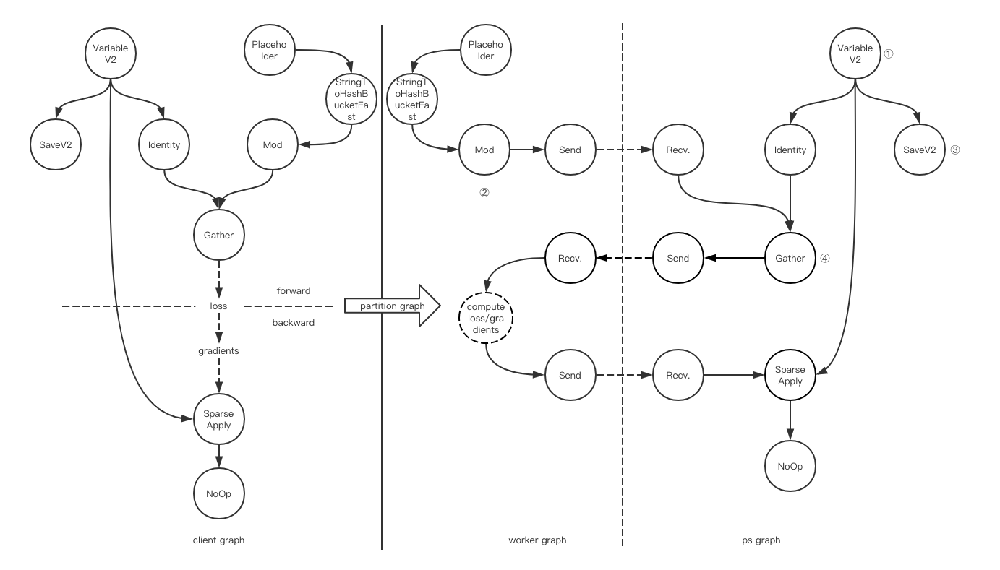

# Embedding Variable in TensorFlow


| Status        | Proposed                |
| ------------- | ----------------------- |
| **Author(s)** | dingchen.mail@gmail.com |
| **Sponsor**   |                         |
| **Updated**   | 2019-11-01              |

## Problem & Motivation

"In TensorFlow, we model all data as tensors(n-dimensional arrays) …... At the lowest level, all TensorFlow tensors are dense…... " which quote from TensorFlow white paper<sup>[1]</sup>  states that Tensor is the basic data structure in TensorFlow. Every component(Operation, Rendervous, BuddleReader, BuddleWriter etc.) in TF framework depends on Tensor. It works well with simple interface, clear hierarchy, elegent design.

​    In large scale sparse data training, `embedding_lookup` is the first layer in train graph, the data storage and transmission is rigid. Usually, users invoke the API and build graph as below:

```python
...
col0 = tf.contrib.layers.sparse_column_with_hash_bucket(column_name = "col0",
                                                        hash_bucket_size = 10000)
feature_columns = [tf.feature_column.embedding_column(categorical_column = col0,
                                                      dimension = 16)]
input_data = tf.contrib.layers.input_from_feature_columns(columns_to_tensors = features,
                                                          feature_columns = feature_columns)
...
```



​    In my example, Variable is a single variable, not partitioned variable, some OP(UniqueOp, UnsortedSegmentSumOp)in ps are ignored. VariableV2 holds real data refer to a dense Tensor whose shape is fixed after user finish build graph, eg: [10000, 16]. All original features map to the Tensor with a set of Ops, which cause a lot of problems:

1. Memory waste, TensorBuffer may have some empty holes<sup>①</sup> because valid data in Tensor is sparse.

2. Feature conflict, hash function and mod operator may result in index collision<sup>②</sup> and make negative effect in model performance.

3. Static tensor shape, it doesn't work in online-learning with the increasing features<sup>①</sup>.

4. Inefficient IO, large Tensor makes save/restore process slow<sup>③</sup>, Tensor should rebuild because sparse data cannot transmiss via Rendervous<sup>④</sup>.

## Objective

TensorFlow framework support sparse data/KV data storage.

## Deisgn Proposal

We create a KV to store sparse data, named "Embedding Variable (EV)", which is compatible with graph execution. 

1. EV, like Variable, is stateful operation. It stores sparse parameters. It only used in Embedding Layer.

2. EV can connect necessary Operations to build a whole graph, such as: Gather, SparseApply, Save, Send Op

3. EV's first dimension is dynamic, it can extend as needed. EV can enlarge or shrink in reasonable range according to user‘s configuration.

4. EV send/receive via rendervous without extra memory copy.

5. EV support incremental checkpoint to speed up model save/restore and save disk space.

### API

Two level API:

- Low-level (like `tf.get_variable`)

```python
# tf.Variable
def get_embedding_variable(name,
                           embedding_dim,
                           key_dtype=dtypes.int64,
                           value_dtype=None,
                           initializer=None,
                           regularizer=None,
                           trainable=True,
                           collections=None,
                           caching_device=None,
                           partitioner=None,
                           validate_shape=True,
                           custom_getter=None,
                           constraint=None,
                           steps_to_live=None):
  # @embedding_dim: embedding dimension size
  # @steps_to_live: ev lifetime
  # create a embedding variable or a partitioned embedding variable
```

- High-level (like `tf.contrib.layers.sparse_column_with_hash_bucket`)

```python
# tf.layers
def tf.contrib.layers.sparse_column_with_embedding(column_name):
    # create a embedding column
```

## Detailed Design

### Framework


### Graph/Operations

1. A new set of Operaitons

 - EVHandleOp
 - EVShapeOp
 - DestroyEVOp
 - InitializeEVOp
 - EVIsInitializedOp
 - EVGatherOp
 - EVSparseApplyAdagrad(Adam/Ftrl/...)Op

2. A new set of compute_gradiend subgraph

- ops.RegisterGradient("EVGatherOp")

3. We regard EV as trainable variable and compute gradients using TensorFlow auto-differential

### Data Structure

Embedding Variable consists of a efficient hashmap and rawBuffers, hashmap's value indicate the pointer of rawBuffer, memory allocation happens during insertion a new KV(feature).

#### Memory Management


- Use 3rd-party hashmap as internal HashMap, such: google::densehashmap

  - Do some optimizations outside the hashmap

  - or more effective hashmap?

- Use tensorflow::allocator as RawBuffer‘s allocator directly, not Tensor or TensorBuffer

- RawBuffer contains embedding_value and version

  - embededing value: storage parameter for training

  - version: storage global_step in which latest kv updates, indicate whether keep this kv or not, it works with steps_to_live parameter, remove kv if the kv is out of date

- Behavior

  - lookup

    - if key not in hashmap, insert a new key-value according users config, and return value

    - else, return existing value

    - invoked by EVGather

  - update

    - update existing value

    - invoked by EVSparseApplyXXX

  - shrink

    - according parameter `steps_to_live` to remove expired key-value, do it in some time interval, such as `save_checkpoint_secs`

    - invoked by TF framework, such TF::Hook

### EV Transmission in Network

#### ZeroCopy in Rendervous

- EVGatherOp's output is not a dense Tensor, is a set of {pointer, len}, pass to iovec directly without any memory copy, See Appendix[3]

### EV Persistence in Checkpoint

#### SaveV2 support EV(EVHandleOp)

- SaveV2 Op support resource as input Tensor, flush to disk without rebuild a new Tensor

#### Incremental Checkpoint

- For Sparse parameter update, save whole data to ckpt is redundant. It is more efficient to save updated kv data.

- This point is a part of sparse data checkpoint design, proposed in other RFCs

## Appendix

Google Doc

https://docs.google.com/document/d/1odez6-69YH-eFcp8rKndDHTNGxZgdFFRJufsW94_gl4

GitHub Issue

[1] https://github.com/tensorflow/tensorflow/issues/19324

[2] https://github.com/tensorflow/tensorflow/issues/24539

[3] https://github.com/tensorflow/tensorflow/issues/24575 

## Reference

[1] https://www.usenix.org/system/files/conference/osdi16/osdi16-abadi.pdf

